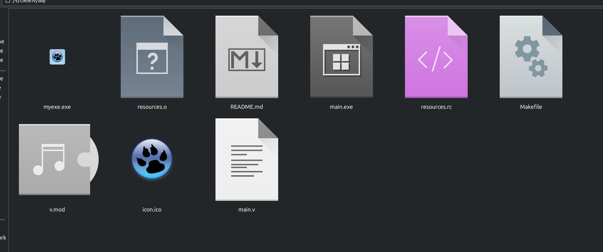

What is this:
==== 
This simple V project, shows how to produce a Windows executable with an icon, on Linux, using V's cross compiling capabilities.

How:
====

Run `make all`

Result:
====
The result can be seen in `Thunar` (on Ubuntu, it also needs: `sudo apt install exe-thumbnailer`), or by uploading your myapp.exe file to a Windows system.

Prerequisites:
====

* Latest V from https://github.com/vlang/v
* a working mingw-w64 package (needed for x86_64-w64-mingw32-windres + x86_64-w64-mingw32-gcc)

See also the [Makefile](Makefile).
